# ARMUGHAN HASSAN KHAN

### Full-Stack Python Developer
**Django • Flask • React • Next.js • Tailwind CSS**

Building modern web applications with clean architecture,
thoughtful interfaces, and real-world functionality.

 

  

---

## ABOUT ME

I'm a full-stack Python developer focused on building
modern, scalable, and maintainable web applications.

My work combines Django-powered backends with modern
frontend technologies to create products that are
visually polished, practical, and built to grow.

I enjoy turning ideas into working applications,
improving existing projects, and continuously
developing my skills across the full stack.

**Current focus:** Full-stack development, product building,
and improving my engineering skills.

---

## WHAT I BUILD

| | |
|---|---|
| **Full-Stack Applications** | Building complete web applications with Django and modern frontend technologies. |
| **Modern Frontend Experiences** | Creating responsive, polished interfaces using React, Next.js, and Tailwind CSS. |
| **Business-Focused Products** | Working on applications designed around real-world workflows and practical use cases. |
| **Clean & Maintainable Code** | Focused on structured development, reusable components, and scalable solutions. |

---

## TECHNICAL STACK

### Backend

  
  
  

### Frontend

  
  
  
  
  
  

### Databases & Tools

  
  
  
  
  
  

---

## FEATURED PROJECTS

A selection of applications I'm building to explore
modern development, solve practical problems, and
strengthen my full-stack engineering skills.

### 01 — STRIDE SCENTS

**A premium perfume e-commerce experience.**

A product-focused web application built around a modern
shopping experience, responsive layouts, and a premium
visual identity.

The project focuses on creating a polished frontend
experience using modern React-based development.

**Stack:** React • Next.js • Tailwind CSS • JavaScript • HTML

**Status:** In Progress

---

### 02 — FLEUR DE LYS SERVICES

**A consultation website for a restaurant catering services.**

A clean, responsive website for restaurant consulation,
using react, and tailwindcss for a better user experience

The project reflects my approach to building structured,
maintainable React applications with a focus on
presentation and usability.

**Stack:** React • Tailwindcss • JavaScript

**Status:** In Progress

---

### 03 — MAYMARMOS

**A small home kitchen website and order system**

A well managed order system website, where user
can easily make order track their order by their order number.

The project explores how a simple, organized interface can
support better user workflows and improve day-to-day
productivity.

**Stack:** React • Tailwind CSS

**Status:** Concept / UI Planning

---

### 04 — AXIORA DIGITAL

**A new application currently in development.**

It's my personal agency where me and my team can showcase our projects, 
That's how we can collaborate with other peoples also helping them with
their projects.

**Stack:** PostgreSQL • Next.js • Tailwind CSS • TailwindCSS

**Status:** In Development

---

## GITHUB ACTIVITY

 

---

## CURRENT FOCUS

- Building more complete full-stack applications
- Improving Django backend architecture
- Developing stronger React and Next.js skills
- Learning better database design and API development
- Creating projects that are useful beyond a simple demo

---

## DEVELOPMENT PHILOSOPHY

> Build with purpose.
> Keep the code clean.
> Improve with every project.

I believe good software is not just about making
something work — it's about building something
that is useful, understandable, and maintainable.

---

## LET'S CONNECT

I'm interested in building useful products,
collaborating on interesting ideas, and connecting
with other developers.

  

<i>Building with purpose. Improving with every project.</i>

